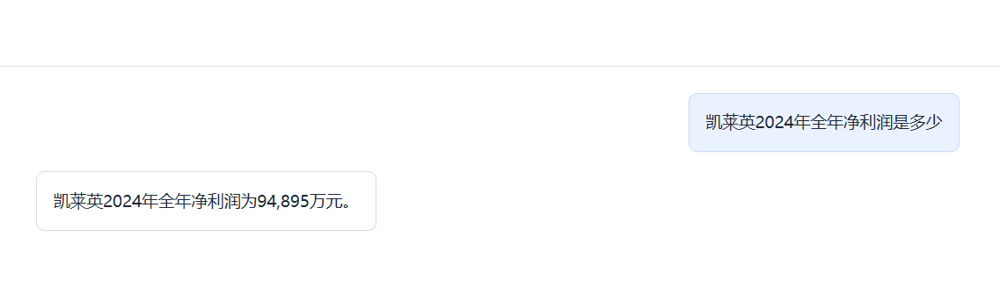
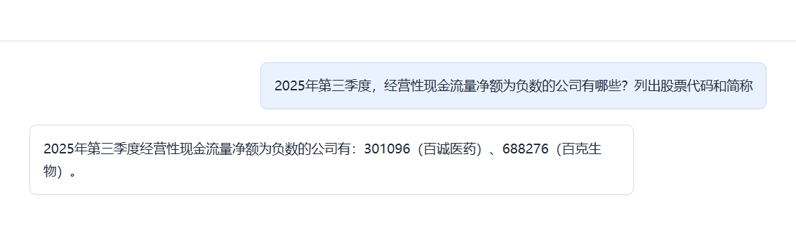
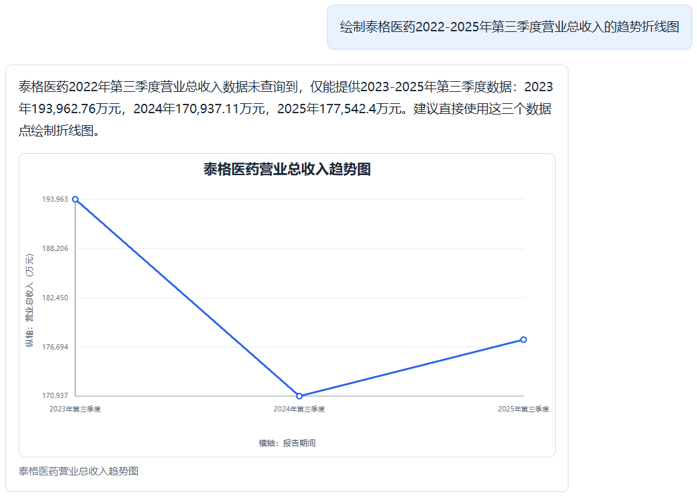
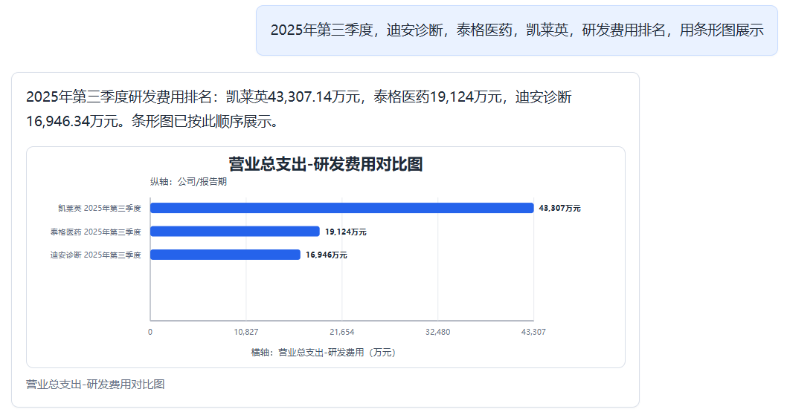
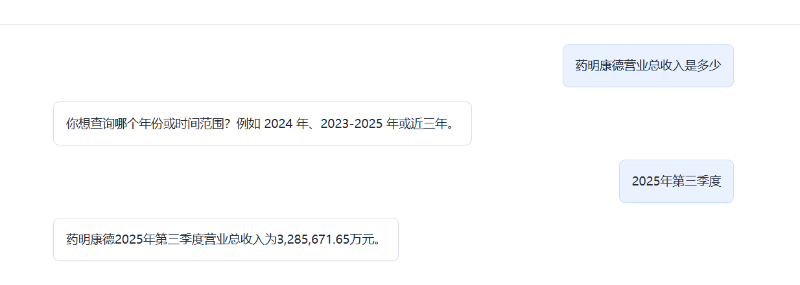
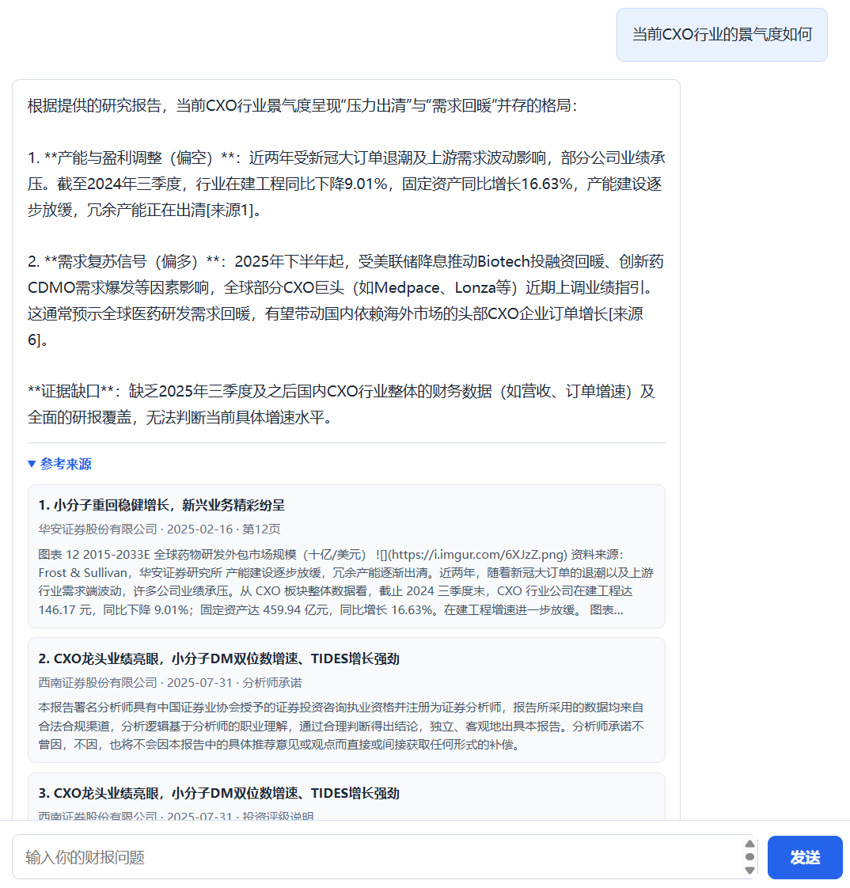
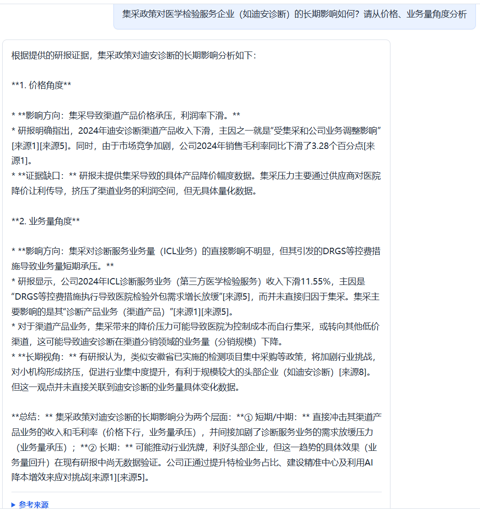

# FinQuery

**本项目已获得2026“泰迪杯”数据挖掘挑战赛国家三等奖**

财报智能问数系统:把上市公司的财报 PDF(非结构化)和券商研报(非结构化)加工成两类可查询资产——结构化财务数据库与语义检索索引;在其上提供自然语言问答服务:精确取数、研报观点问答、数字+观点融合分析,以及处理多步复杂问题的 Agent 模式。

```text
"白云山2024年一年下来总共卖了多少钱的货?"     → 精确到万元的数据库查询结果
"当前CXO行业的景气度如何?"                    → 带来源标注的研报观点综合
"对比药明康德和凯莱英的净利润并分析驱动因素"    → 数字 + 研报证据的融合分析(Agent 多步执行)
```

## 系统能力

| 层 | 能力 | 入口 |
| --- | --- | --- |
| 数据构建(离线) | 财报 PDF → 结构化四表(staging → 质检 → 正式表);研报 markdown → 混合检索索引 | scripts/ |
| 智能问数 | 自然语言 → 槽位 → 受控 DSL → 参数化 SQL;缺槽位自动澄清追问;多轮会话 | `POST /query/ask` |
| 研报问答 | BM25+向量粗排 → cross-encoder 精排 → 多样性配额;元数据硬过滤 | `POST /rag/ask` |
| 融合分析 | 财务数字与研报观点分离取证、统一作答 | `POST /analysis/ask` |
| Agent 模式 | LLM function-calling 循环自主规划多步查询(四工具),带执行轨迹 | `POST /analysis/ask` + `use_agent` |

## 核心设计原则

1. **数字永远来自数据库**:LLM 只做语言理解(问题 → 槽位)与表达(结果 → 文案),从不产出数字。
2. **LLM 不写 SQL**:意图槽位经白名单校验(76 公司/60 指标/4 报告期均为封闭集合),SQL 由确定性编译器参数化生成;幻觉值在执行前被拦截。
3. **每一层都可降级**:LLM 意图解析失败 → 规则引擎兜底;精排模型缺失 → 粗排结果;Agent 循环异常 → 单轮固定管道。任何情况下服务有响应。
4. **不猜测**:缺关键槽位(公司/年份/报告期)时澄清追问,绝不默认填充。

## 评测结果

| 评测 | 结果 |
| --- | --- |
| 意图引擎:官方题目 | 使用规则引擎解析成功率达90%以上 |
| 意图引擎:25 道变体题(口语化/换表述/错别字) | 使用LLM引擎解析成功率达到96% | 
| RAG 检索:文档级消融 | hybrid+rerank hit_rate 91.3% / recall 59.1% |
| Agent模式 vs 固定工作流:30 道多意图/归因题盲评 | Agent 胜率 83%(25/30),0 降级 |

## 问答结果示例








## 公开仓库的数据边界

为避免泄露凭据、提交超大文件或未经授权再分发财报/研报,仓库不包含以下内容:

- 原始财报 PDF、券商研报及比赛附件题目;
- PostgreSQL 数据目录与数据库转储;
- 生成的 markdown、FAISS 索引和 chunk 语料;
- DeepSeek/MinerU 等服务密钥;
- BGE 模型权重。

仓库仅保留运行单元测试所需的最小 schema registry 与公司公开元数据。`python -m pytest`
不依赖外部 LLM、PostgreSQL 或模型权重;完整 Web 演示和评测需要使用者自行准备具有合法
使用权限的数据,并按下文构建数据库与检索索引。

## 快速开始

### 1. 环境

```bash
conda env create -f environment.yml
conda activate finquery-agent
pip install -e '.[rag,pdf,dev]'
```

需要完整 RAG 能力时,从模型发布方下载到项目根目录:

```bash
huggingface-cli download BAAI/bge-base-zh-v1.5 --local-dir bge-base-zh-v1.5
huggingface-cli download BAAI/bge-reranker-base --local-dir bge-reranker-base
```

### 2. 数据库

```bash
python scripts/manage_postgres.py init      # 首次初始化(conda 内 PG,端口 55432)
python scripts/manage_postgres.py start
python scripts/manage_postgres.py createdb
python scripts/apply_schema.py              # 建表
python scripts/load_company_info.py         # 公司维表
# 使用具有合法权限的 PDF 构建财务数据:
python scripts/extract_pdf.py --help
python scripts/promote_staging.py --help
# 若你有自己的数据库转储,也可自行恢复。
```

### 3. LLM 与检索配置

```bash
cp config/llm.example.json config/llm.json   # 填入 DeepSeek API key(勿提交)
cp config/rag.example.json config/rag.json   # 可选,默认值即可用
```

`enabled` 控制答案润色,`intent_enabled` 控制 LLM 意图解析——两者独立开关,全关时系统以纯规则模式运行。

### 4. 启动

```bash
conda activate finquery-agent
python scripts/manage_postgres.py start        # PG 未运行时
cd ~/FinQuery                                   # 必须项目根目录(模型是相对路径)
uvicorn finquery_agent.api.main:app --port 8000
```

打开 `http://127.0.0.1:8000/` 使用内置 Web UI(含 Agent 开关与执行轨迹面板)。
```

## 项目结构

```text
src/finquery_agent/
  schema/      字段注册表:表结构、指标别名、公司维表(所有白名单校验的依据)
  ingestion/   PDF 抽取、清洗、字段映射、staging → 正式表晋升
  nl2sql/      意图引擎(规则/LLM/混合)、DSL、SQLBuilder、澄清会话、图表
  rag/         研报加载切分、BM25+FAISS 混合检索、cross-encoder 精排
  analysis/    财务数据 + 研报证据的融合分析
  agent/       function-calling 工具、计划-执行循环、Agent 服务
  llm/         公共 LLM 客户端(重试/降级)
  api/         FastAPI 与内置 Web UI
scripts/       数据管理与评测脚本
docs/          技术报告(PDF 抽取 / 问数 / RAG / Agent)与流程图集
data/evaluation/  评测数据集与报告
```
